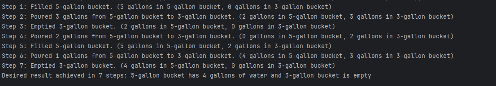
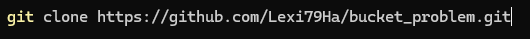

<h1>The 4-gallon Bucket Problem</h1>
<h3>Problemscape</h3>
<h4>Create a program that can solve the 4-gallon jub riddle. The conditions of the riddle is to fetch a total of 4 gallons of water from  a stream using only an unmarked 5 gallon bucket, and an unmarked 3 gallon bucket in less than 15 steps.</h4>
<h4> A video illustrations of this riddle and the steps to finding a solution can be found here  (https://www.youtube.com/watch?v=qtg9pSJsRSg) </h4>
<h3>Solution</h3>
<h4>This program uses a while not loop under the conditions that "Five_gallon_bucket = 4 and the three_gallon_bucket = 0"</h4>
<h4>The steps of the loop are as followed: Fill five_gallon_bucket, Pour five_gallon_bucket into the three gallon bucket, then empty three gallon bucket once it reached max capacity, this continues until all conditions are satisified</h4>
<h2>Expected Results</h2>

<h2>How to use</h2>
<h4> Download zip file or clone on your local system using command line prompt below </h4>

<h2> How to test</h2>
<h4> Run test.py</h4>
<h4> Unittest library is built into python so there is no need to install it</h4>
<h2>Technology Used</h2>
<h4>Uses version 3.12 of python</h4>
<h4>Test library = unittest</h4>
<h2>Author</h2>
<h4>Alexis Harris</h4>
<h4>Email: lmh.mo.6@gmail.com</h4>
