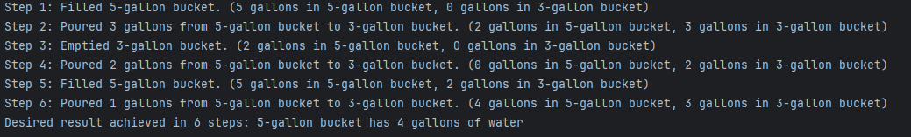

<h1>The 4-gallon Bucket Problem</h1>
<h3>The parameters of the problem</h3>
<h4>Fetch exactly 4 gallons of water from a stream using only an unmarked 5 gallon bucket, and an unmarked 3 gallon bucket in less than 15 steps.</h4>
<h2>Expected Results</h2>

<h2>Technology Used</h2>
<h4>Uses version 3.12 of python</h4>
<h4>No libraries will need to be imported to run this program</h4>
<h2>Author</h2>
<h4>Alexis Harris</h4>
<h4>Email: lmh.mo.6@gmail.com</h4>
